# Daily Social Posts Pipeline (LinkedIn)

Every day at **11:00 AM** it generates the LinkedIn batch and delivers it to one Slack
channel. When you type **`schedule`** in Slack, it schedules the LinkedIn posts.

<p align="center">
  
</p>

<details>
<summary>Text version of the flow</summary>

```
11:00 AM (launchd)                          You type "schedule" in Slack
   │                                              │
   ├─ LinkedIn: generate full batch ──┐           └─ LinkedIn: schedule posts (Chrome 9222)
   │  (proven engine, ~/linkedin-pipeline)
   └─ deliver to Slack ───────────────┘  #linkedin-content
```

</details>

## Layout

| Path | What |
|---|---|
| `run_daily.sh` | 11 AM job: LinkedIn batch → Slack |
| `slack_trigger_poller.py` | Watches Slack for `schedule`; runs the LinkedIn scheduler |
| `theme/theme.json` | Shared design tokens (single source of truth) |
| `linkedin/` | Snapshot copy of the LinkedIn engine (live generation uses `~/linkedin-pipeline` via `LINKEDIN_DIR`) |

> **Source of truth for LinkedIn:** the live daily run drives the proven engine at
> `~/linkedin-pipeline` (set via `LINKEDIN_DIR` in `run_daily.sh`), so nothing about the
> existing LinkedIn automation changed except where it's triggered from. The `linkedin/`
> subfolder here is a reference snapshot.

## Daily prerequisites (for the `schedule` step)

Browser automation needs your logged-in Chrome window open:

```bash
bash linkedin/linkedin_launch.sh     # port 9222 — log into LinkedIn, leave open
```

Then in Slack, after the 11 AM drop lands, type **`schedule`**.

## launchd jobs

| Label | Schedule | Script |
|---|---|---|
| `com.harshrajpathak.social-daily` | 11:00 daily | `run_daily.sh` |
| `com.harshrajpathak.social-slack-trigger` | every 120 s | `slack_trigger_poller.py` |

The old `com.harshrajpathak.linkedin-daily` and `…linkedin-slack-trigger` jobs were
**unloaded** (their plist files remain) so LinkedIn isn't generated/scheduled twice.
Re-enable the old ones with `launchctl load ~/Library/LaunchAgents/com.harshrajpathak.linkedin-*.plist`.

## Manual run

```bash
bash run_daily.sh                 # full daily (LinkedIn → Slack)
```
